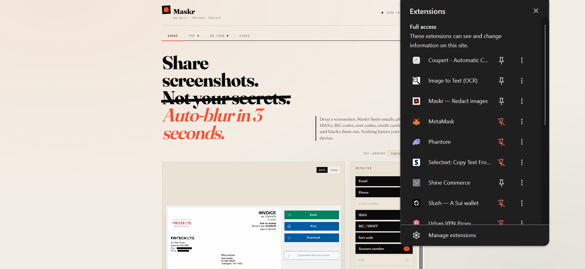

# Maskr

**Redact screenshots in seconds. 100% in your browser. Nothing ever leaves your device.**



Drop a screenshot, let Maskr find the sensitive data, download the clean version. No account, no upload, no server — everything runs locally using WebAssembly OCR and on-device face detection.

---

## What it does

| Detection | Examples |
|-----------|---------|
| Emails | `user@example.com` |
| Phone numbers | `+1 (555) 123-4567` |
| Credit card numbers | `4111 1111 1111 1111` (Luhn-validated) |
| IBANs | `GB29NWBK60161331926819` |
| URLs | `https://internal.company.com/secret` |
| Long numbers | Order IDs, account numbers (7+ digits) |
| Faces | People in photos (on-demand, uses BlazeFace) |
| Manual boxes | Draw your own over anything OCR misses |

Three redaction styles: **Block** (solid black), **Blur**, **Pixelate**.

---

## How to use

1. Open the app in any modern browser
2. Drop, paste (`Ctrl+V` / `Cmd+V`), or click to upload a screenshot
3. Maskr scans the text — detected items appear in the panel on the right
4. Toggle categories on/off, optionally click **Find faces**
5. Switch to **Draw** mode to manually box anything the auto-scan missed
6. Download PNG or copy to clipboard

No install. No login. Works offline after first load.

---

## Privacy

- **Zero uploads.** OCR runs via [Tesseract.js](https://github.com/naptha/tesseract.js) (WebAssembly, in-browser).
- **Zero tracking.** No analytics, no cookies, no external pings.
- **Zero servers.** The only network requests are loading the page assets and (optionally, on demand) the face detection model from Google's CDN.
- Face detection uses [MediaPipe BlazeFace](https://developers.google.com/mediapipe) — the model downloads once when you click "Find faces" and runs entirely on your device.

---

## Tech stack

| Piece | Technology |
|-------|-----------|
| UI | Vanilla HTML/CSS/JS — single file, no build step |
| OCR | [Tesseract.js v5](https://github.com/naptha/tesseract.js) |
| Face detection | [MediaPipe Tasks Vision](https://developers.google.com/mediapipe/solutions/vision/face_detector) (lazy-loaded) |
| Hosting | Cloudflare Pages |
| Deployment | GitHub Actions → `wrangler pages deploy` |

---

## Local development

No build step required. Just open `index.html` in a browser:

```bash
# Option 1 — open directly
start index.html          # Windows
open index.html           # macOS

# Option 2 — serve locally (avoids some browser clipboard restrictions)
npx serve .
# or
python -m http.server 8080
```

Paste behaviour and clipboard export work best when served over `http://localhost` rather than opened as a `file://` URL.

---

## Deployment

Every push to `master` deploys automatically to Cloudflare Pages via `.github/workflows/deploy.yml`.

**One-time setup required:**

1. Create a Cloudflare Pages project named `maskr` at [dash.cloudflare.com](https://dash.cloudflare.com) → Workers & Pages → Create application → Pages.
2. Add two secrets to the GitHub repo (`Settings → Secrets → Actions`):

| Secret | Where to find it |
|--------|-----------------|
| `CLOUDFLARE_API_TOKEN` | Cloudflare dashboard → My Profile → API Tokens |
| `CLOUDFLARE_ACCOUNT_ID` | Cloudflare dashboard → right sidebar |

After that, push to `master` = live in ~30 seconds.

---

## Roadmap

See [ROADMAP.md](ROADMAP.md) for the full plan. Near-term priorities:

- Right-click a box to delete just that one
- Undo / redo (Ctrl+Z)
- Multi-language OCR (French, Arabic)
- EXIF metadata stripping on export

---

## Changelog

See [CHANGELOG.md](CHANGELOG.md).

---

## License

Free to use. Built by the Taskflow team.
